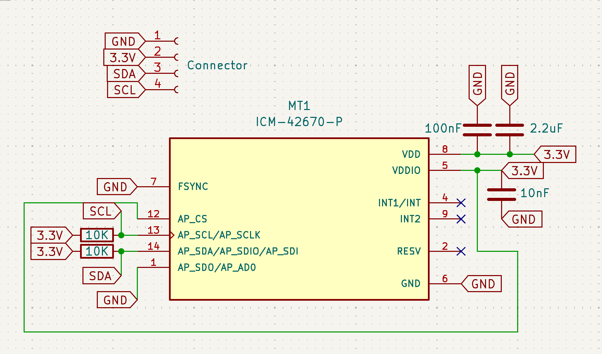
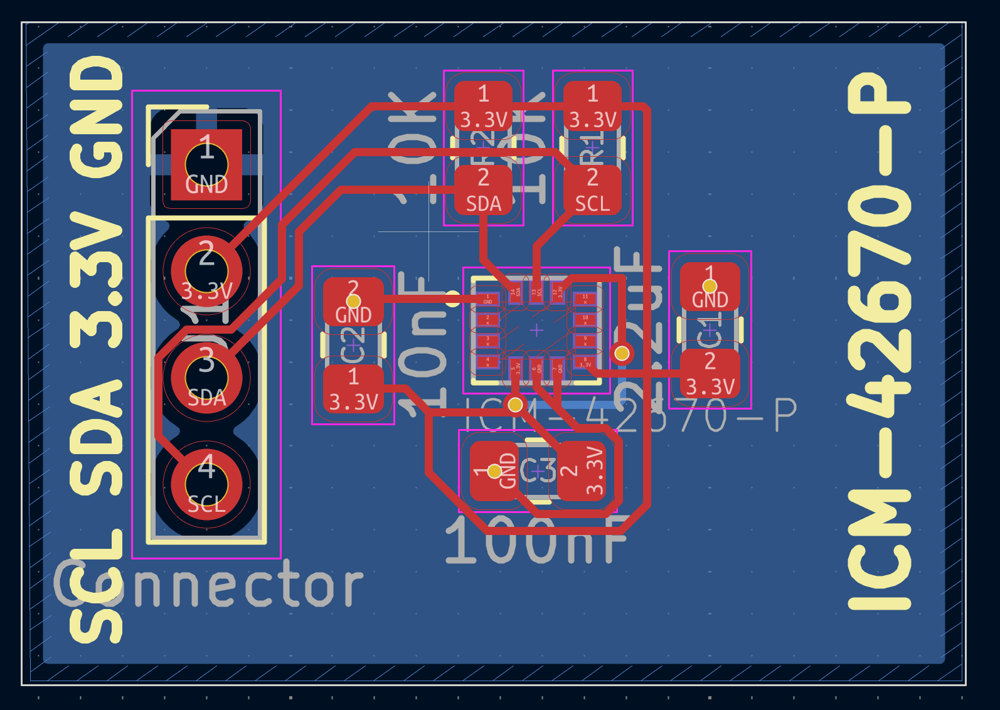

# ICM-42670-P
ICM-42670-P Module board

The ICM-42670-P is a compact 6-axis inertial measurement unit used in many modern electronic devices. It combines a 3-axis gyroscope and a 3-axis accelerometer in a single chip. This sensor is designed for applications that require motion sensing and orientation detection. It is widely used in smartphones, wearable devices, and IoT products. The sensor provides high accuracy for motion tracking and gesture recognition. It supports both I²C and SPI communication interfaces.

The ICM-42670-P is known for its low power consumption, which makes it suitable for battery-powered devices. It integrates advanced filtering features to improve the quality of sensor data. The device can detect movement, tilt, rotation, and vibration. It helps electronic systems understand their position and motion in space. The sensor is also used in robotics and drone stabilization systems. It includes programmable registers that allow developers to configure its behavior.

The sensor offers reliable performance even in small embedded systems. It can operate over a wide range of temperatures. The gyroscope in the device provides precise angular velocity measurements. The accelerometer measures linear acceleration in three directions. This sensor helps improve motion-based user interfaces in many devices. It is manufactured by TDK Corporation as part of its motion sensor products. The chip also supports embedded motion detection features that reduce the workload of the main processor. Overall, the ICM-42670-P is a reliable solution for motion-tracking applications.

## Code

Library used:
https://github.com/tdk-invn-oss/motion.arduino.ICM42670P

## Scheme

## Board

## Sponsorship

This project is kindly sponsored by [PCBWay](https://pcbway.com).
PCBWay specializes in manufacturing high-quality PCBs and makes them affordable to hobbyist and professionals alike.

The range of services they offer include PCB prototyping, assembly, instant quotes for your order, a verification process by a team
of experts and an easy to use, hassle-free order process.

I'm grateful to PCBWay for the support in creating this project.
